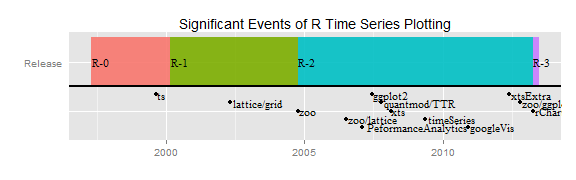

```{r setup, include=FALSE}
knitr::opts_chunk$set(echo = TRUE,
                      message = FALSE,
                      warning = FALSE)
```

```{r, eval = F, echo = F}
# RUN ONCE TO CACHE DATA
# saveRDS(sp500, file = "data/sp500.rds")
# saveRDS(stock_prices, file = "data/stock_prices.rds")
# saveRDS(sp500_returns, file = "data/stock_returns.rds")
# saveRDS(sp500_stats, file = "data/stats.rds")

# saveRDS(FANG, file = "data/fang.rds")
```

```{r, echo = FALSE}
# Load libraries
library(tidyquant)

# Load Data Sets
sp500 <- readRDS("data/sp500.rds")
sp500_stock_prices <- readRDS("data/stock_prices.rds")
sp500_returns <- readRDS("data/stock_returns.rds")
sp500_stats <- readRDS("data/stats.rds")

FANG <- readRDS("data/fang.rds")
```


# Abstract


# Status of Financial Analysis Tools in R

The R programming language has seen immense growth in both popularity and tools over the past several years primarily driven by the open source nature of the R language and the explosion in the field of data science. The sub-segment of financial analysis in R is no different. [TimelyPortfolio](https://timelyportfolio.github.io/rCharts_time_series/history.html) maintains a nice timeline of the major advances in R time series plotting, which highlights the inception of several of the most influential finance packages.



Several packages are worth describing in more detail as these create much of the foundation of R in Finance currently:

## quantmod / TTR

The _"Quantitative Financial Modelling & Trading Framework for R"_ or `quantmod` package and the _"Technical Trading Rules"_ or `TTR` package includes mechanisms to retrieve, compute, and visualize financial data using the most popular technical trading rules. 

## xts / zoo

The _"Extensible Time Series"_ or `xts` package along with the `zoo` package includes mechanisms for the handling of time series data. Most importantly, the `xts` package created a cross-package mechanism for handling the various time-series data structures, in the process solving a major shortcoming by managing all time series objects under one class, `xts`. Additionally, the package includes functionality to subset and plot time-based objects using `zoo`. 

## PerformanceAnalytics

The `PerformanceAnalytics` package includes a large collection of econometric functions for financial performance analysis, many of which are described in _"Practical Portfolio Performance Measurement and Attribution"_ by Carl Bacon. These functions enable analysis of individual asset and portfolio (aggregation of multiple assets) returns using popular statistical methods for measuring performance.

# New Tools: tidyverse

In parallel, with the progress being made within the R in Finance community, developers at RStudio have been working to provide useful tools for data science in R, namely the `tidyverse`. These include several packages worth describing in more detail.

## dplyr / tidyr

The `dplyr` and `tidyr` packages provide tools to clean and manipulate data using the _"split-apply-combine"_ framework popularized by Hadley Wickham in "The Split-Apply-Combine Strategy for Data Analysis". The major advances were twofold. First, the packages simplified and made consistent many of the most common data manipulation tasks in R. Second and arguably more importantly, the packages incorporated the use of the pipe (`%>%`) from the `magrittr` package enabling the functional verbs to follow an easy, efficient, and human-readable workflow. 

## purrr

The `purrr` package provides tools for applying functions to data frames. Similar to the traditional, `lapply` function, `purrr` enables mapping functions within a data frame. The major advance is that analysis can be performed with "nested" data frames allowing users to keep the entire data analysis workflow in one tidy data frame. 

## tibble

The `tibble` package extends the traditional `data.frame` object by providing useful tools for creating and coercing objects to "tibbles" or tidy data frames.

## ggplot2

The `ggplot2` package provides a method of creating complex visualizations using a layered approach called the "grammar of graphics", which is discussed in [INSERT REF]. The `ggplot2` package has become the dominant form of creating static graphics in the "tidy" ecosystem.

[ref]

## lubridate

The `lubridate` package includes functions to manage date and date-time objects in R, which is essential for working with time series.

[ref]

# Divergent Philosophies, Each with Advantages

All of the major finance packages work with the `xts` system, which is specifically designed for time series analysis. The system works very well. The extensible time series, "xts", data structure was designed solely for time series analysis. The data structure is much like a numeric matrix, the only major difference being row names consisting of the date or date-time information. The advantage to "xts" objects are the ability to manage numeric data with date or date-time references. The objects can be subset or transformed to different periodicity very easily. The disadvantage is the application is very strict to numeric data, but because of its focus it manages the time series data extremely well. 

Much of the recent innovation in data analysis has occurred within the tidy ecosystem. With the entrance of the `tidyverse`, scaling analysis using the _"split-apply-combine"_ framework has become easy, efficient, and core functionality. Further, advances in date and date-time functionality has enabled management of time series data within the "tibble" ("tidy" data frame) data structure. As the data science field grows, more innovative functionality will continue to be developed within the "tidy" ecosystem, much of which will be (and is already) useful to the field of financial analysis.

The two systems, `xts` and the `tidyverse`, are very different on a fundamental and philosophical level. Both have advantages that are needed within the realm of financial analysis, but unfortunately the two systems do not work well together. The "xts" system is strictly numeric-based, while the "tidy" system is strictly data frame-based. Passing data between systems is difficult if not painful, and without communication between each the full potential of financial analysis within R is limited.

To solve this problem, the `tidyquant` package was developed as a way to integrate many of the financial analysis packages within the `tidyverse`. In the next section, the _"split-apply-combine"_ framework is discussed conceptually using non-financial data and then a demonstration of the `tidyquant` package is presented to illustrate some of the key benefits to the integration of financial packages into the "tidy" ecosystem within the realm of financial analysis.

# Split-Apply-Combine Concepts

The _"split-apply-combine"_ framework is discussed at length in [INSERT REF]. To summarize, the core concept is to split a data set into groups, apply functional analysis, and then recombine. The value in this approach is the framework enables scaling analysis from one group to many groups and comparing each group to each other. Rather than discuss in terms of theory, an example is using the `mtcars` data set is a better illustration of the _"split-apply-combine"_ framework. 

Start with a question:

> How does engine size affect fuel consumption?

Load the `tidyverse` and the `mtcars` data set in R.

```{r}
library(tidyverse)
data("mtcars")
```

Next, view the data set. The `as_tibble` function is used to convert to the "tidy" data frame structure. The data set consists of 32 rows of data related to various automobiles. Some of the data is categorical, which can be grouped on.

```{r}
mtcars <- as_tibble(mtcars)
mtcars
```

Many solutions exist to compare fuel consumption and engine size. For simplicity, the mean and standard deviation are used to characterize the relationship between number of cylinders, "cyl", and miles per gallon, "mpg". Implementing _"split-apply-combine"_ is as easy as grouping by a categorical variable and summarizing by the target measure.

```{r}
mtcars %>%
    mutate(cyl = factor(cyl)) %>%
    group_by(cyl) %>%
    summarize(mpg.mean = mean(mpg),
              mpg.sd = sd(mpg))
```

From the results, the vehicles, when grouped by "cyl", appear to have an inverse relationship between number of cylinders and miles per gallon. We can also visualize this relationship using `ggplot2`.

```{r}
mtcars %>%
    mutate(cyl = factor(cyl)) %>%
    ggplot(aes(x = cyl, y = mpg, fill = cyl)) +
    geom_boxplot() +
    labs(title = "Summarizing Relationships using Split-Apply-Combine",
         subtitle = "ggplot2 Creates Powerful Visualizations")
```

Using the _"split-apply-combine"_ framework is easy to implement, but what how does it improve financial analysis? Onto more applicable examples to the realm of financial analysis.


# Split-Apply-Combine Applications in Finance

As stated previously, the financial analysis packages do not work well within the "tidy" ecosystem. A new tool is needed, `tidyquant`. __The `tidyquant` package has one major advance: it integrates the financial packages with the `tidyverse` to enable the "tidy" ecosystem functionality to be applied to financial data.__ The innovation is relatively minor on a conceptual level, but the net effect is significant in that the tools within the "tidy" ecosystem are now unlocked for financial analysis. 

## Example 1: Evaluating Risk vs Reward

Start with a question:

> How does the stock market value risk versus reward?

This is vague, but answerable by comparing stock returns. Risk is typically associated with volatility, which can be measured by standard deviation. Reward is measured by returns, which can be measured by averaging returns over many periods. To start, load `tidyquant`, which loads all of the packages needed to evaluate risk versus reward.

```{r, eval = F}
# Loads tidyquant, tidyverse, lubridate, quantmod, TTR, xts, zoo, PerformanceAnalytics
library(tidyquant)
```


Next, collect some financial data. The question implies that a large sample of stock data is needed to evaluate how performance and risk is valued within the "market". The SP500 index is a good place to start. `tidyquant` includes a function, `tq_index`, which returns the stock symbols and company names within an index.

```{r, eval = FALSE}
sp500 <- tq_index("SP500")
sp500
```

```{r, echo = F}
sp500
```

Next, the stock prices are easy to retrieve with `tq_get`, using the "get" option, `get = "stock.prices"`. `tq_get` is a wrapper for `quantmod::getSymbols`, which enables passing the underlying function parameters `from` and `to`. The input to `tq_get` is `data`, which can be a single stock symbol, a vector of stock symbols, or a data frame with stock symbols in the first column. The latter is passed to `tq_get` using the pipe (`%>%`). The function may take a few minutes to run because it is downloading the past ten years of daily open, high low close, volume, and adjusted stock prices for the entire SP500 index into one "tidy" data frame. It appears that the prices were retrieved in entirety. The "tibble" has `r nrow(sp500_stock_prices) %>% scales::comma()` rows and `r sp500_stock_prices$symbol %>% unique() %>% length()` unique symbols. 


```{r, eval = F}
stock_prices <- sp500 %>%
    tq_get(get  = "stock.prices", 
           from = "2007-01-01", 
           to   = "2017-01-01")
sp500_stock_prices
```

```{r, echo = F}
sp500_stock_prices
```


Next, the _"split-apply-combine"_ framework is used to group the prices by stock symbol and to calculate the logarithmic daily returns. The log returns are used to create a more "normal" distribution. The transform is applied using `tq_transform`, which is used in situations where periodicity changes (or can change). The `quantmod` OHLC (open, high, low, close) notation is used to collect the adjusted prices (`ohlc_fun = Ad`) and send these prices to the `periodReturn` function (`transform_fun = periodReturn`). The additional arguments, `period = "daily"` and `type = "log"` are passed to the transformation function, which is `periodReturn`. The `col_rename = "dlr"` is a quick renaming function for the output column. In this case, "dlr" refers to daily log returns. The daily log returns (DLR) for each of the `r sp500_returns$symbol %>% unique() %>% length()` groups of stock symbols is generated below.

```{r, eval = F}
sp500_returns <- sp500_stock_prices %>%
    group_by(symbol) %>%
    tq_transform(ohlc_fun = Ad, transform_fun = periodReturn, 
                 period = "daily", type = "log", col_rename = "dlr")
sp500_returns
```

```{r, echo = F}
sp500_returns
```

Next, the mean and standard deviation of the daily log returns are used to evaluate and compare the stocks. The easiest way is to use `tq_performance`, which enables applying the `PerformanceAnalytics` performance functions to "tidy" data frames of asset or portfolio returns. The `table.Stats` function returns the arithmetic mean and standard deviation along with a number of other useful statistics that characterize the returns.

```{r, eval = F}
sp500_stats <- sp500_returns %>%
    tq_performance(Ra = dlr, performance_fun = table.Stats, ci = 0.95, digits = 6) 
sp500_stats
```

```{r, echo = F}
sp500_stats
```

Finally, we have the tools to visualize risk versus reward. Risk can be characterized by the standard deviation, or volatility, and reward can be characterized by average returns. A plot of MDLR versus SDDLR shows the relationship. The market tends to penalize stocks with higher standard deviations of daily log returns (SDDLR), or in other words more volatility.

```{r}
sp500_stats %>%
    filter(Observations >= 252 * 5) %>%
    ggplot(aes(x = Stdev, y = ArithmeticMean, col = (ArithmeticMean / Stdev))) +
    geom_point() +
    geom_smooth(method = "lm") +
    labs(title = "Evaluating Risk Vs Reward for Stocks in the SP500 Index",
         subtitle = "Split-Apply-Combine Enables Scaling Financial Analysis",
         caption = "Looks like an inverse relationship exists between MDLR and SDDLR",
         x = "Standard Deviation of Daily Log Returns (SDDLR)",
         y = "Arithmetic Mean of Daily Log Returns (MDLR)") +
    theme_tq()
```


## Example 2: Visualizing Portfolio Performance

Portfolio aggregation is a useful technique to reduce risk while maintaining returns. In this example, the goal is to evaluate a few blended portfolios of "FANG" stocks ("FB", "AMZN", "NFLX", "GOOG" popularized by Jim Cramer). The following portfolio blends will be evaluated:

* Portfolio 1: 50% FB, 25% AMZN, 25% NFLX, 0% GOOG
* Portfolio 2: 0% FB, 50% AMZN, 25% NFLX, 25% GOOG
* Portfolio 3: 25% FB, 0% AMZN, 50% NFLX, 25% GOOG
* Portfolio 4: 25% FB, 25% AMZN, 0% NFLX, 50% GOOG

First, collect the data for the "FANG" stocks.

```{r, eval = F}
FANG <- c("FB", "AMZN", "GOOG", "NFLX") %>%
    tq_get(get = "stock.prices",
           from = "2007-01-01",
           to   = "2017-01-01")
FANG
```

```{r, echo = F}
FANG
```

Next, transform to monthly returns using the _"split-apply-combine"_ framework. Use `group_by` to group on the "symbol" column, and `tq_transform` to transform the adjusted prices to monthly arithmetic returns. Note that "FB" was actively traded for a full year begining in 2013, so it makes sense to compare the investments since then.

```{r}
FANG_returns <- FANG %>%
    filter(date >= ymd("2013-01-01")) %>%
    group_by(symbol) %>%
    tq_transform(ohlc_fun = Ad,
                 transform_fun = periodReturn,
                 period = "monthly",
                 col_rename = "returns")
FANG_returns
```

### Individual Asset Performance

Before the portfolios are generate, it makes sense to visualize and assess the performance of the individual asset returns. NFLX is the best performer, but it also makes sense to investigate risk.

```{r}
init_investment <- 10000
FANG_wealth <- FANG_returns %>%
    mutate(wealth.index = init_investment * cumprod(1 + returns))

FANG_wealth %>%
    ggplot(aes(x = date, y = wealth.index, color = symbol)) +
    geom_line(size = 2) +
    geom_smooth(method = "loess") +
    labs(title = "Individual Stocks: Comparing the Growth of $10K",
         x = "", y = "Investment Value") +
    theme_tq() +
    scale_color_tq() +
    scale_y_continuous(labels = scales::dollar)
```

Use `tq_performance` with another table function, `table.DownsideRisk`, to estimate risk measures accross the FANG stocks. While NFLX returns are stellar the risk is also very high.

```{r}
FANG_returns %>%
    tq_performance(Ra = returns, Rb = NULL, performance_fun = table.DownsideRisk)
```

### Portfolio Performance

Now onto portfolios. The stocks returns need to be aggregated, which takes three steps:

1. Make a portfolio by repeating the stock returns 
2. Create a weights table to map weights of various portfolios
3. Aggregate the portfolios using `tq_portfolio`, a wrapper for `PerformanceAnalytics::Return.portfolio`

#### Step 1: Make a portfolio by repeating the stock returns

Use `tq_repeat_df` to repeat `n = 4` times. This function grows the data frame length-wise, adding an index column named "portfolio", and grouping by "portfolio". We now have four groups that will be used as portfolios. 

``` {r}
FANG_returns_mult <- FANG_returns %>%
    tq_repeat_df(n = 4)
FANG_returns_mult
```

#### Step 2: Create a Weights Table to Map Weights

Constructing a weights table using the portfolio blending parameters:

* Portfolio 1: 50% FB, 25% AMZN, 25% NFLX, 0% GOOG
* Portfolio 2: 0% FB, 50% AMZN, 25% NFLX, 25% GOOG
* Portfolio 3: 25% FB, 0% AMZN, 50% NFLX, 25% GOOG
* Portfolio 4: 25% FB, 25% AMZN, 0% NFLX, 50% GOOG

``` {r}
weights_table <- tribble(
    ~portfolio, ~stocks, ~weights,
    1,          "FB",    0.50,
    1,          "AMZN",  0.25,
    1,          "NFLX",  0.25,
    1,          "GOOG",  0.00,

    2,          "FB",    0.00,
    2,          "AMZN",  0.50,
    2,          "NFLX",  0.25,
    2,          "GOOG",  0.25,

    3,          "FB",    0.25,
    3,          "AMZN",  0.00,
    3,          "NFLX",  0.50,
    3,          "GOOG",  0.25,

    4,          "FB",    0.25,
    4,          "AMZN",  0.25,
    4,          "NFLX",  0.00,
    4,          "GOOG",  0.50) %>%
    group_by(portfolio)
weights_table
```

#### Step 3: Aggregate the Portfolios with tq_portfolio

Aggregating portfolio using `tq_portfolio`, a wrapper for `PerformanceAnalytics::Return.portfolio`. The `Return.portfolio` has additional arguments to create a wealth index, which is the compounded returns. Setting `wealth.index = TRUE` and multiplying the result by the initial investment value of $10,000 returns a wealth index.

``` {r}
# C: Aggregate portfolio with tq_portfolio. Pass wealth.index = TRUE
init_investment <- 10000
FANG_portfolio_wealth <- FANG_returns_mult %>%
    tq_portfolio(assets_col = symbol, returns_col = returns,
                 weights = weights_table, wealth.index = TRUE,
                 col_rename = "wealth.index") %>%
    mutate(wealth.index = wealth.index * init_investment)
```

Next, we can visualize the performance of the various blended portfolios.

``` {r}
FANG_portfolio_wealth  %>%
    ggplot(aes(x = date, y = wealth.index, color = factor(portfolio))) +
    geom_line(size = 2) +
    geom_smooth(method = "loess") +
    labs(title = "Portfolios: Comparing the Growth of $10K",
         subtitle = "Quickly visualize blended portfolio performance",
         x = "", y = "Investment Value",
         color = "Portfolio Number: ") +
    theme_tq() +
    scale_color_tq() +
    scale_y_continuous(labels = scales::dollar)
```

Finally, the risk is assessed in the same manner as the individual assets. The portfolio aggregation without is performed without the `wealth.index` option, which aggregates uncompounded returns. The returns are "piped" to the `tq_performance` function, which returns the downside risk table. Portfolio 1 appears to have a good combination of high returns and low downside risk.

```{r}
FANG_returns_mult %>%
    tq_portfolio(assets_col = symbol, returns_col = returns,
                 weights = weights_table, col_rename = "returns") %>%
    tq_performance(Ra = returns, Rb = NULL, performance_fun = table.DownsideRisk)
```

# Conclusion

